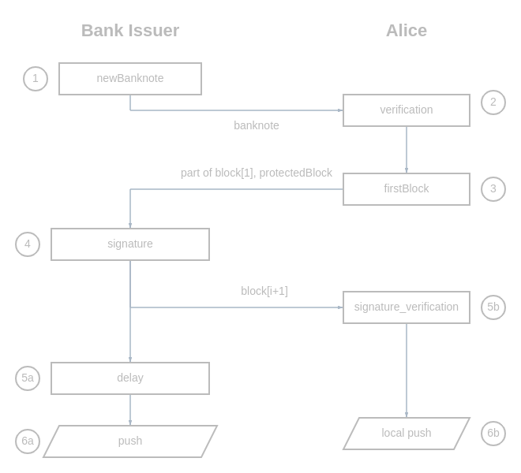
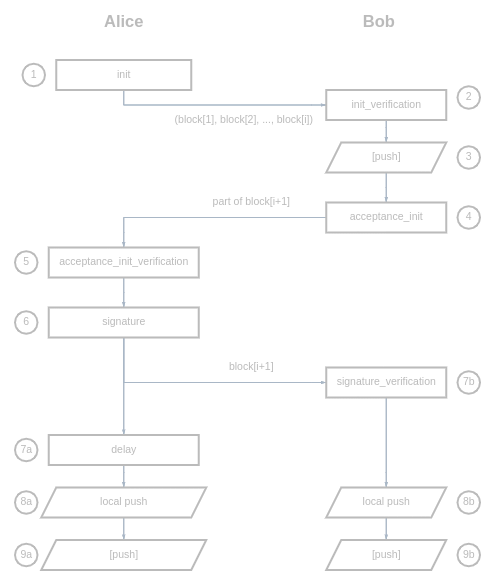

# Open Digital Cash -- Kotlin Core

(Russian)

## Передача банк -> клиент




Обмен следующий.

---

**Шаг 1**
Банк-эмитент создаёт новую банкноту:
```kotlin
    val banknote = bankIssuer.newBanknote(
            amount = amount,
            bin = BIN,
            currencyCode=ISO_4217_CODE.RUB,
    )
```

После эта банкнота передаётся Алисе.

---

**Шаг 2**
Алиса верифицирует корректность банкноты
```kotlin
    if ( ! banknote.verification(bok)){
        throw Exception("Банкнота поддельная")
    }
```
---
**Шаг 3**
Алиса генерирует ***часть** первого блока блокчейна.

(!) *На **каждую** банкноту генерируется свой блокчейн*

```kotlin
var (block, protectedBlock) = walletA.firstBlock(banknote)
```

`protectedBlock` -- это защищённый блок блокчейна. 
Данный блок передаётся только между двумя парами передающих сторон
а так же при операции **push** на сервер.

Таким образом имея весь блокчейн мы не можем сказать кто был участником, 
кроме последнего блока (что логично.)

После Алиса передаёт `block` и `protectedBlock` банку-эмитенту

---

**Шаг 4**

Банк подписывает первый блок блокчейна:
```kotlin
block = bankIssuer.signature(banknote, block, protectedBlock)
```

Этот блок передаётся Алисе. 
Банк некоторое время ждёт (**Шаг 5а**), на случай если пакет пропадёт.

---

**Шаг 5b.**

Алиса перепроверяет что блок `block` корректно записан

---

**Шаг 6 (а,b)** -- запись в локальный блокчейн и в глобальный блокчейн

## Передача клиент -> клиент

Передача между двумя клиентами может происходить как offline, так и online.

[//]:  https://programforyou.ru/block-diagram-redactor



---

**Шаг 1**
Инициализация запроса на передачу.

Для этого нужно сформировать:
```kotlin
val parentBlock = banknote_blockchain.last()

val protectedBlock_part = ProtectedBlock(
        parentSok=walletA.sok,
        parentSokSignature=walletA.sokSignature,
        parentOtokSignature=walletA.otokSignature(parentBlock.otok),
        refUuid=null,
        sok=null,
        sokSignature=null,
        otokSignature=null,
)
```
и передать `banknote_blockchain` и `protectedBlock_part` по каналу Бобу

---

**Шаг 2**
Боб проверяет весь блокчейн
```kotlin
var lastKey = bok
for (block in banknote_blockchain){
    block.verification(lastKey)
    lastKey = block.otok
}
```

(!) *Можно оптимизировать и в конце каждого блока поставить подпись банка.
Тогда нужно проверять только с самого последнего блока, для которого есть подпись*

---

**Шаг 3** (опционально)

Если есть сеть -- лучше ещё подписать и проверить в банке. 

Но операции можно проводить офлайн

---

**Шаг 4** 

Боб принимает купюру, для этого он должен создать свой блок
```kotlin
var (childBlock, protectedBlock) = walletB.acceptanceInit(parentBlock, protectedBlock_part, bok)
```

Данные передаются по каналу Алисе

--- 

**Шаг 5**

Алиса проверяет корректность ключей 
(подфункция `acceptanceInitVerification` внутри `signature`) 
и подписывает:
```kotlin
childBlock = walletA.signature(parentBlock, childBlock, protectedBlock, bok)
```

Данный блок передаётся по каналу. 
На всякий случай Алиса выжидает (**Шаг 6a**) и переходит к **Шагу 7**.

---

**Шаг 6b**

Боб проверяет корректность последнего блока 
(весь блокчейн проверен на **шаге 2**):
```kotlin
if (! childBlock.verification(parentBlock.otok)){
    throw Exception("childBlock некорректно подписан")
}
```

---

**Шаг 7**
Записываем новый блок в блокчейн
```kotlin
banknote_blockchain.add(childBlock)
banknote_protectedBlockChain.add(protectedBlock)
```


---